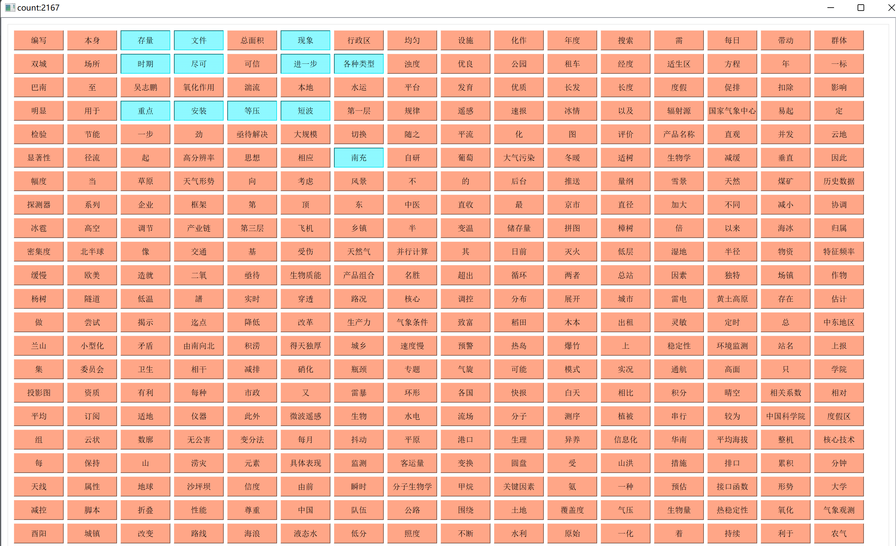
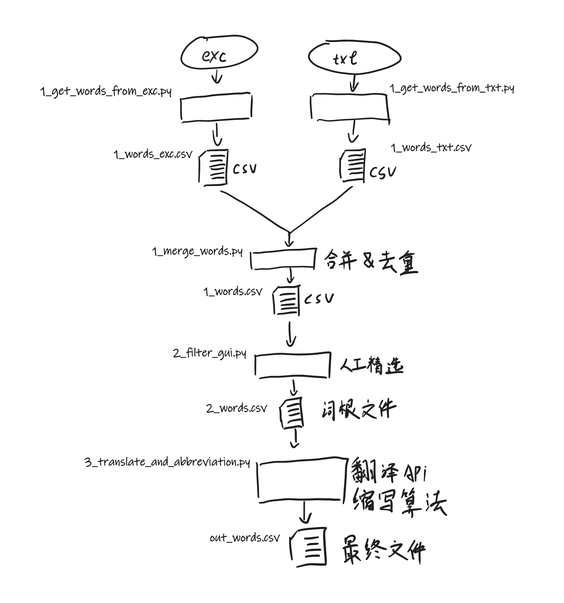

# GenerateWordsMete

此工具用于初步制作中文词根

具体流程如下

1. 将excl与word读入汇总为大文本，分别对其大文本进行 'jieba' 库分词，筛选出包含中文的字词，最后将汇总并去重。
2. 使用编写的UI工具 '2_filter_gui.py' 进行人工精细筛选
   
3. 用谷歌API翻译出对应英文，并计算出单词缩写

## 缩写策略

1. 单个单词 & 长度小于7 => 直接使用小写全词
2. 单个单词 & 长度大于7 => 单词前4字母 + 最后字母
3. 两个单词 & 二单词长度小于6 => 一单词首字母 + 后单词小写全词
4. 两个单词 & 二单词长度大于6 => 一单词首字母 + 后单词前4字母
5. 更多单词 => 抽取每个词开头
6. 查重并标记重复词对 ###num

## 流程示意图

